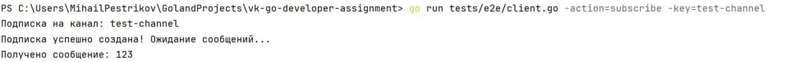
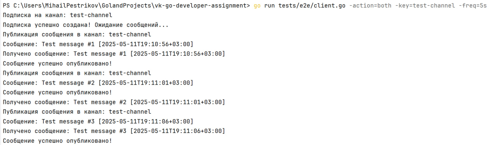
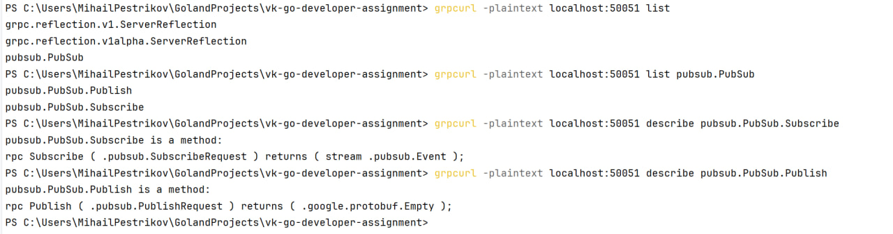

# Сервис подписок

Данный проект реализует систему шины событий по принципу publish-subscribe с gRPC-интерфейсом. Проект состоит из двух основных частей:
1. Пакет `subpub`, реализующий паттерн Publisher-Subscriber
2. gRPC-сервис, который использует пакет `subpub` для предоставления функциональности подписок по сети

## Возможности

### Пакет subpub
- Поддержка множества подписчиков на один subject
- Медленные подписчики не тормозят быстрых
- Сохранение порядка сообщений (FIFO очередь)
- Учёт контекста при завершении работы
- Отсутствие утечек горутин
- Различные стратегии обработки медленных подписчиков:
    - `DropNone`: Блокировка при заполнении буфера (ожидание подписчика)
    - `DropOldest`: Удаление самых старых сообщений при заполнении буфера
    - `DropNewest`: Отбрасывание новых сообщений при заполнении буфера
- Реализация пула воркеров для ограничения количества горутин

### gRPC-сервис
- Подписка на события по ключу
- Публикация сообщений всем подписчикам по ключу
- Структурированное логирование
- Настраиваемые параметры сервера
- Корректное завершение работы (graceful shutdown)

## Архитектура

Проект следует принципам чистой архитектуры:
- `pkg/subpub`: Основная реализация publish-subscribe системы
- `internal/server`: Реализация gRPC-сервера
- `cmd/subscription-service`: Точка входа в сервис
- `api/proto`: Определения Protocol Buffers
- `config`: Конфигурационные файлы
- `/pkg` - Переиспользуемые компоненты (конфигурация, логирование)
- `tests`: Инструменты для тестирования

## Сборка и запуск

### Требования
- Go 1.24 или новее
- Компилятор Protocol Buffers (если нужно перегенерировать proto-файлы)


### Установка и запуск с Docker
1. Клонировать репозиторий:
```bash
git clone https://github.com/mihailpestrikov/vk-go-developer-assignment
cd vk-go-developer-assignment
```

2. Запустить:
```bash
docker-compose up --build
```

## Конфигурация

Сервис настраивается через YAML-файл. По умолчанию используется `config/config.yaml`.

```yaml
server:
  host: "0.0.0.0"           # Хост сервера
  port: 50051               # Порт сервера
  max_concurrent_streams: 100  # Максимальное количество одновременных gRPC-потоков

subpub:
  buffer_size: 100          # Размер буфера сообщений для каждого подписчика
  drop_strategy: "newest"   # Стратегия обработки медленных подписчиков (none, oldest, newest)
  worker_pool_size: 10      # Размер пула воркеров для обработки сообщений

log:
  level: "debug"            # Уровень логирования (debug, info, warn, error)
  format: "json"            # Формат логов (json, console)
```

## Тестирование

### Модульные тесты
Проект включает модульные тесты для пакета `subpub`. Для их запуска:

```bash
go test -v ./pkg/subpub/...
```

### Интеграционное тестирование
В проекте есть клиент для end-to-end тестирования сервиса. Клиент может:
- Подписываться на канал и получать сообщения
- Публиковать сообщения в канал
- Делать и то, и другое одновременно

Для запуска E2E тест-клиента:

```bash
# Подписаться и публиковать в test-channel каждые 5 секунд
go run tests/e2e/client.go -action=both -key=test-channel -freq=5s

# Только опубликовать одно сообщение
go run tests/e2e/client.go -action=publish -key=test-channel -message="123"

# Только подписаться на канал
go run tests/e2e/client.go -action=subscribe -key=test-channel
```

Параметры клиента:
- `-addr`: Адрес сервера (по умолчанию: "localhost:50051")
- `-action`: Действие (subscribe, publish или both)
- `-key`: Ключ канала для подписки или публикации
- `-message`: Сообщение для публикации
- `-freq`: Частота публикации сообщений при действии "both"

Отправка сообщения:
<br>

Получение сообщения:
<br>

Отправка и получение:
<br>

## Использование API с помощью grpcurl

Для взаимодействия с API сервиса можно использовать инструмент [grpcurl](https://github.com/fullstorydev/grpcurl). Ниже приведены примеры команд:

### Получение информации о доступных сервисах
```bash
grpcurl -plaintext localhost:50051 list
```

### Получение информации о методах сервиса
```bash
grpcurl -plaintext localhost:50051 list pubsub.PubSub
```

### Получение информации о структуре запросов и ответов
```bash
grpcurl -plaintext localhost:50051 describe pubsub.PublishRequest
grpcurl -plaintext localhost:50051 describe pubsub.SubscribeRequest
grpcurl -plaintext localhost:50051 describe pubsub.Event
```

<br>

## Используемые паттерны проектирования

1. **Dependency Injection**:
  - Все зависимости явно передаются в структуры через конструкторы

2. **Functional Options**:
  - Применяется для гибкой настройки пакета `subpub`
  - Позволяет указывать только нужные параметры, оставляя остальные со значениями по умолчанию
  - Пример: `NewSubPub(WithBufferSize(100), WithDropStrategy(DropNewest))`

3. **Worker Pool**:
  - Используется для ограничения количества одновременных горутин
  - Обеспечивает равномерное распределение вычислительной нагрузки
  - Реализован в пакете `subpub` для эффективной обработки сообщений

4. **Middleware**:
  - Применяется для инкапсуляции сквозной функциональности:
    - Логирование входящих и исходящих запросов
    - Добавление метаданных к запросам (ID запроса, временные метки)
    - Обработка ошибок и восстановление после паники
  - Реализовано для унарных и потоковых gRPC-запросов

5. **Graceful Shutdown**:
  - Обеспечивает корректное завершение работы всех компонентов
  - Последовательно останавливает:
    - Прием новых запросов
    - Завершение gRPC-сервера
    - Закрытие всех подписок
    - Остановку пула воркеров
  - Гарантирует отсутствие утечек ресурсов и потери данных

## Обработка ошибок

Сервис использует стандартные коды статуса gRPC:
- `OK`: Успешная операция
- `InvalidArgument`: Некорректные параметры запроса
- `Unavailable`: Сервис недоступен (например, система закрыта)
- `Internal`: Внутренняя ошибка сервера
- `NotFound`: Нет активных подписчиков для данного ключа